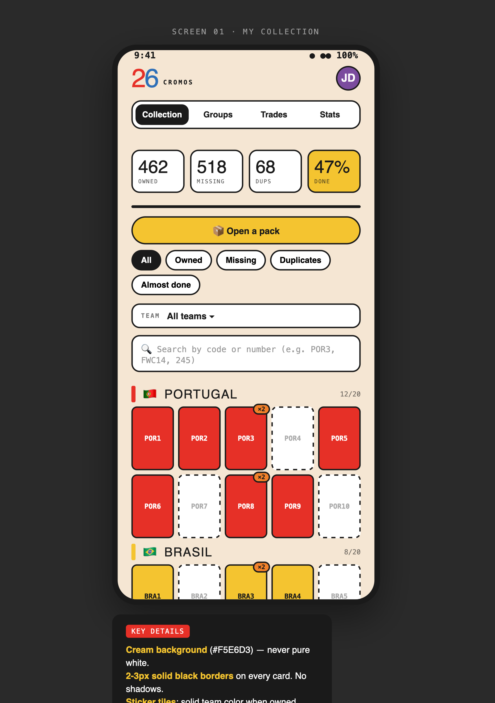
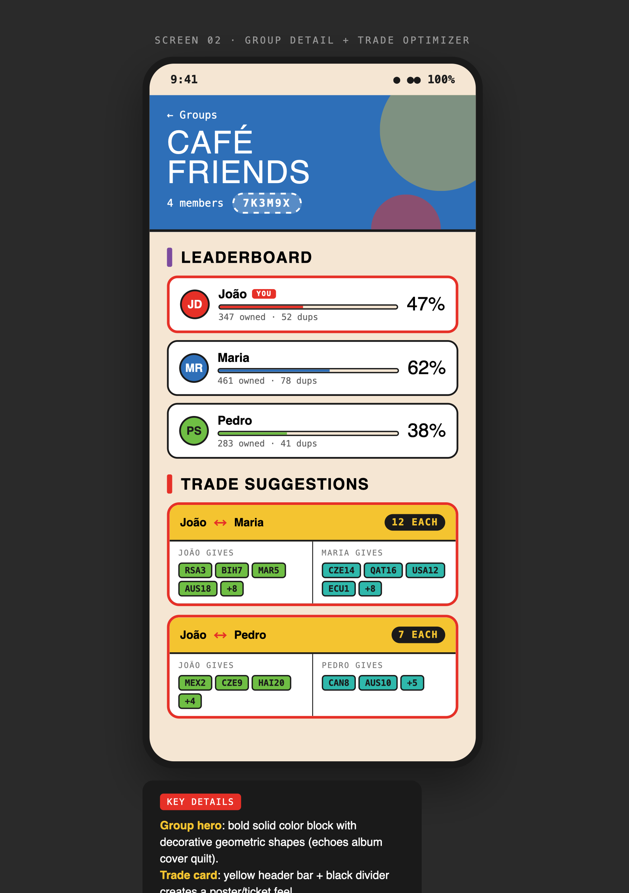
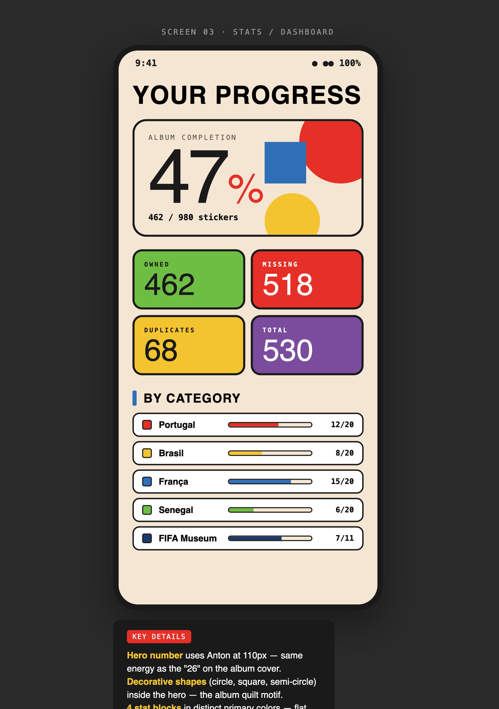

# Cromos 26

Mobile-first web app for the **Panini FIFA World Cup 2026™ sticker collection**. Track all
980 stickers, share groups with friends via a 6-character invite code, run the multi-trade
optimiser, and add a whole pack with one paste.

**[Open the app →](https://stickers.martinsnuno.com)**

<p align="center">
  
  
  
</p>

> Visual identity is directly inspired by the official album cover: cream backgrounds,
> primary-colour quilt motifs, thick black borders, the iconic "26" numerals in Anton.

## Features

- **Album-accurate numbering** — `00`, `FWC1..FWC19`, `MEX1..MEX20`, `POR1..POR20` exactly
  as printed on the stickers, plus a fast search by code or raw integer.
- **Open a pack** — paste `POR1 POR3 MEX12 FWC14 245`, see the live preview, hit add.
  Counts increment so duplicates are tracked automatically.
- **Bulk mode** — tap many stickers in sequence to mark them as owned without toggling.
- **Smart filters** — owned, missing, duplicates, and an "Almost done" view that surfaces
  what is left in teams that are 70%+ complete. Filter persists across sessions.
- **Long-press = exact count** — set a duplicate to ×3, ×5, etc.
- **Groups + invite codes** — 6-character uppercase code, no email or phone required.
- **Multi-trade optimiser** — finds balanced N-for-N swaps across a group; works even
  when the obvious 1-for-1 trade isn't available.
- **Direct trades view** — pick a friend, see what they have that you need and vice versa.
- **Stats hero + missing list** — copy your missing numbers in one tap to share in a chat.
- **Bilingual** — full Portuguese (PT-PT) and English. Auto-detects from browser locale.
- **Google sign-in** — optional, alongside the email + password flow. JWT in an
  `httpOnly` cookie, no localStorage tokens.
- **15-second background sync** — TanStack Query polling keeps two devices in step
  without WebSockets.

## Tech stack

| Layer            | Tech                                                          |
| ---------------- | ------------------------------------------------------------- |
| Frontend         | React 18 + Vite + TypeScript + Tailwind + Framer Motion       |
| Data fetching    | TanStack Query (15s background polling)                       |
| Backend          | Node 20 + Fastify + TypeScript + Zod                          |
| Database         | PostgreSQL 16 + Prisma                                        |
| Auth             | email + bcrypt + JWT (`httpOnly` cookie) + Google OAuth 2.0   |
| Containerisation | Docker + docker-compose                                       |
| Reverse proxy    | Caddy 2 (auto Let's Encrypt TLS)                              |
| CI/CD            | GitHub Actions: build + test on push, SSH deploy on `main`    |
| Hosting          | Hetzner Cloud (Helsinki, EU)                                  |

Monorepo managed with **pnpm workspaces**.

## Try it without cloning

The app is hosted at **[stickers.martinsnuno.com](https://stickers.martinsnuno.com)** with
free Google sign-in. No invite list — just sign up.

## Quick start

### Prerequisites

- Node.js 20+
- pnpm 9.12+ (`corepack enable && corepack prepare pnpm@9.12.0 --activate`)
- Docker & Docker Compose

### Local development

```bash
pnpm install
cp .env.example .env

# Postgres + API in containers, web on host with hot reload
docker compose up -d db api
docker compose exec api npx prisma migrate dev --name init   # first time only
pnpm --filter @cromos/web dev
```

Open <http://localhost:5173>. Vite proxies `/api/*` to the API container so `fetch('/api/…')`
just works.

### Common commands

```bash
pnpm typecheck                                    # workspace-wide TS check
pnpm test                                         # unit tests (trade optimiser etc.)
pnpm build                                        # build everything
pnpm --filter @cromos/api prisma:studio           # open Prisma DB browser
pnpm --filter @cromos/api prisma:migrate          # create a new migration
docker compose down -v                            # nuke local DB
```

## Project structure

```
cromos-26/
├── apps/
│   ├── web/                    React + Vite frontend
│   │   └── src/
│   │       ├── components/     StickerTile, AvatarMenu, PackModal, …
│   │       ├── pages/          Collection, Groups, GroupDetail, Trades, Stats, Legal
│   │       ├── hooks/          useAuth
│   │       └── i18n/           PT-PT + EN dictionaries
│   └── api/                    Fastify backend
│       ├── src/routes/         auth, google, collection, groups, trades, stats
│       └── prisma/             schema + migrations
├── packages/
│   └── shared/                 Sticker config (980 layout) + trade optimiser + types
├── design-refs/                DESIGN.md, mockups, logos, screenshots
├── scripts/backup.sh           Daily Postgres backup
├── docker-compose.yml          Local dev (postgres + api)
├── docker-compose.prod.yml     Production stack (db + api + web-static + caddy)
├── Caddyfile                   Reverse proxy with auto-TLS
├── .github/workflows/          CI + deploy pipelines
├── DEPLOY.md                   Step-by-step Hetzner deployment guide
└── CLAUDE.md                   Onboarding for future agent sessions
```

## Screens

| Collection | Group | Stats |
| :---: | :---: | :---: |
|  |  |  |

## Design system

A flat, poster-like look that echoes the official album cover.

| Token | Value |
| --- | --- |
| Cream (background) | `#F5E6D3` |
| Ink (text + borders) | `#1A1A1A` |
| Red | `#E63027` |
| Yellow | `#F4C430` |
| Blue | `#2E6FB8` |
| Green | `#6FBE44` |
| Display font | Anton |
| Body font | DM Sans |
| Numbers / labels | JetBrains Mono |
| Border width | 2–3px solid Ink, no shadows, no gradients (except the album-progress bar) |

Full guidelines in [`design-refs/DESIGN.md`](design-refs/DESIGN.md).

## Sticker numbering

The 980-sticker layout in `packages/shared/src/stickers.ts` is the single source of
truth and matches the printed album exactly:

- `#1` → `00` — Panini silver foil
- `#2..#20` → `FWC1..FWC19` — tournament intro + FIFA Museum (past champions)
- `#21..#980` → 48 teams × 20 stickers, prefixed with the 3-letter FIFA code
  (`MEX1..MEX20`, `POR1..POR20`, …, `PAN1..PAN20`)

The internal integer (1..980) is the source of truth; labels are derived via
`stickerLabel(n)` so the storage layer never moves. A runtime sanity check throws if
ranges overlap or don't sum to 980 — keep that.

## Google OAuth setup

The app supports email/password sign-in plus "Continue with Google" via OAuth 2.0. It is
**optional** — without credentials the button is hidden. To enable it:

1. Create a project at <https://console.cloud.google.com/>.
2. **APIs & Services → OAuth consent screen** — External, scopes
   `userinfo.email` + `userinfo.profile` + `openid`. With only those scopes the app
   can be **published** without Google verification.
3. **Credentials → Create OAuth client ID → Web application.**
   - Authorised JavaScript origins: `http://localhost:5173`, `http://localhost:3000`,
     `https://your-domain`.
   - Authorised redirect URIs: `http://localhost:3000/api/auth/google/callback`,
     `https://your-domain/api/auth/google/callback`.
4. Copy `Client ID` + `Client secret` into `.env` / `.env.production`:
   ```env
   GOOGLE_CLIENT_ID=…
   GOOGLE_CLIENT_SECRET=…
   ```
5. Restart the API.

Existing email/password accounts are auto-linked on first Google sign-in if the email
matches.

## Privacy

Cromos 26 stores only what it needs to run: name, email, sticker counts, group
memberships. No third-party analytics, no advertising, no marketing emails. Full
detail in the in-app Privacy Policy or [`/legal/privacy`](https://stickers.martinsnuno.com/legal/privacy).

## Deployment

See [DEPLOY.md](./DEPLOY.md) for the full Hetzner Cloud + custom domain setup
(server hardening, Docker, DNS, Caddy/TLS, GitHub Actions auto-deploy, backups).

## Sister app

[**wc26**](https://github.com/martinsmdnuno/wc26) is the predictions / betting-pool
companion app for the same tournament. Same hands, complementary problem.

## License

[MIT](./LICENSE) — Cromos 26 is not affiliated with, endorsed by or sponsored by
Panini, FIFA or any participating association. All trademarks belong to their
respective owners.
